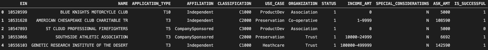
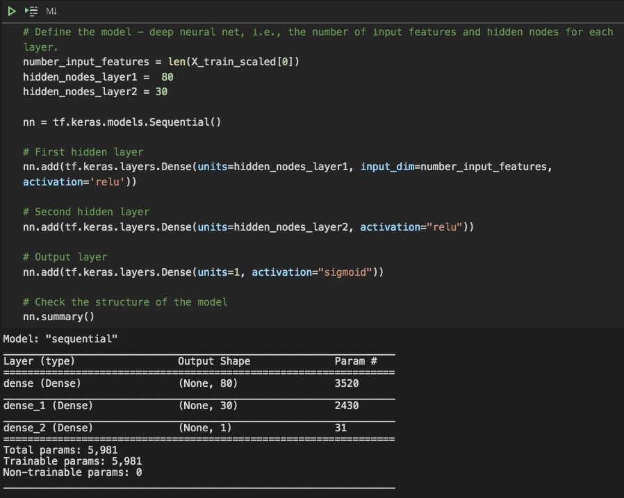
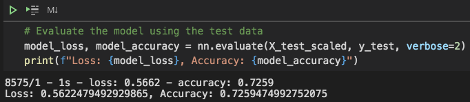
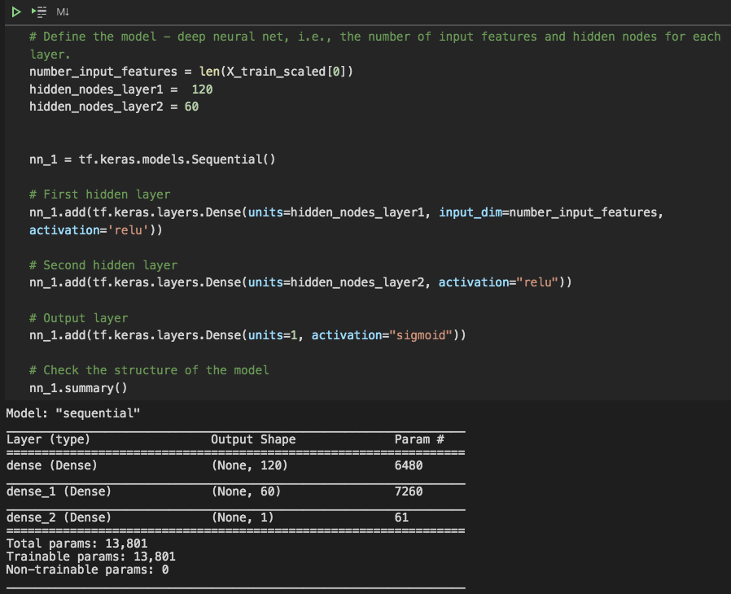
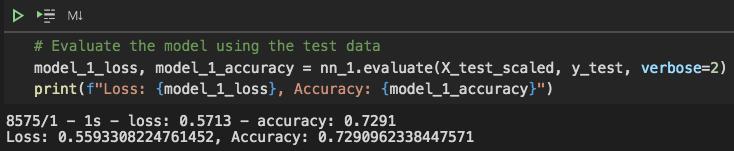
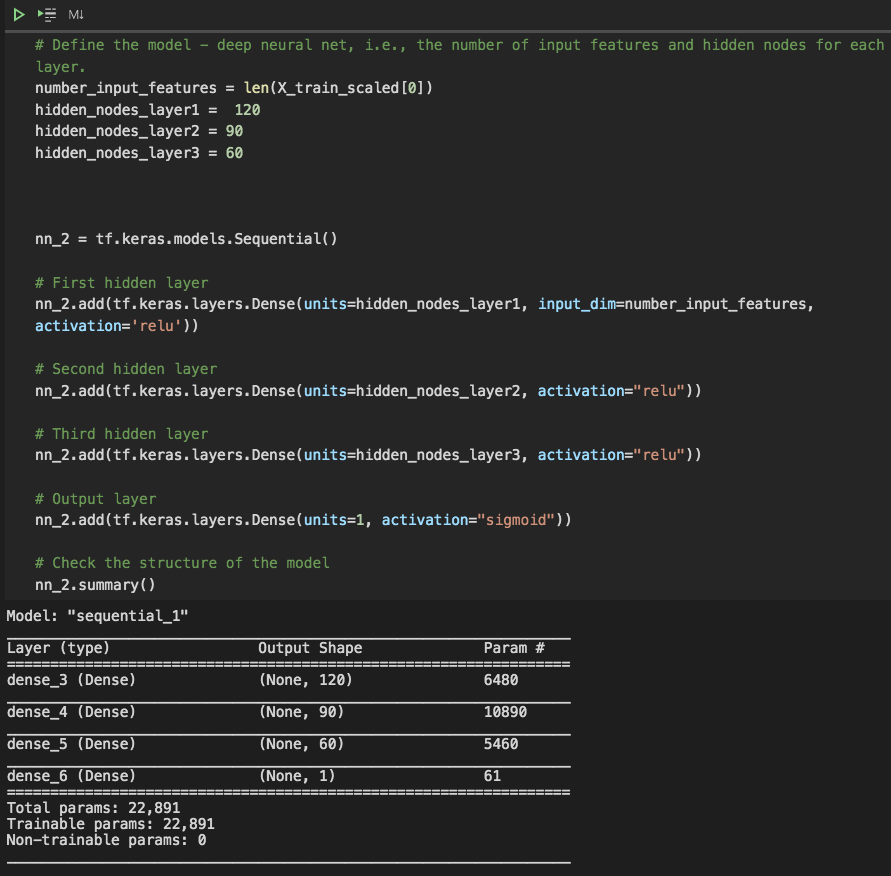
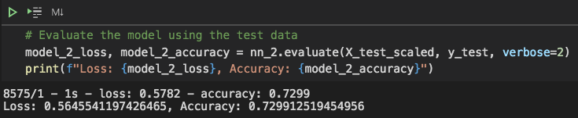
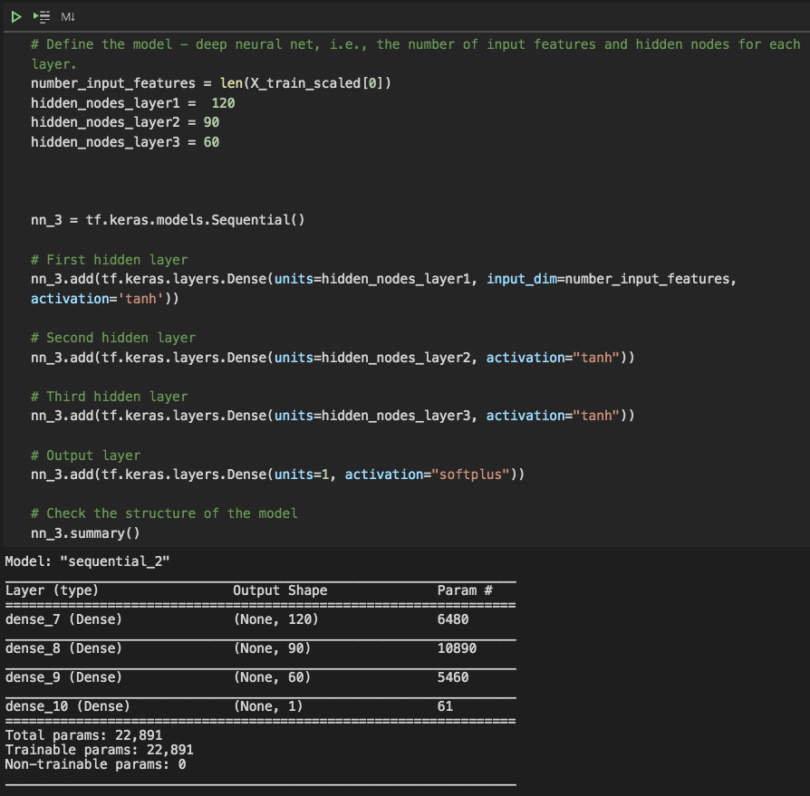
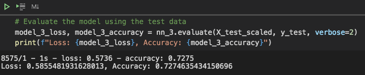
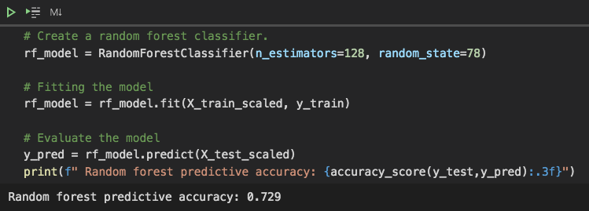

# **Neural_Network_Charity_Analysis**  

## **Overview of Project**
In this project we are performing an analysis to help a non profit foundation "Alphabet Soup", that helps funding the organizations that protect the environment, to predict if the applicants will be successful if funded by them.

### **Purpose**

Our data source is a table that contains 12 columns and almost 35,300 rows (applications). [Fig. 1](screen_shots/1.png) shows a part of this dataset:

|*Fig. 1*|
:--:
||

&nbsp;

We used this dataset and neural networks to create a binary classifier to predict if an organization will be successful.
&nbsp;

## **Results**  

For this project we used Jupyter notebook and Pandas, tensorflow and sklearn packages. 

- First, "EIN" and "NAME" columns were dropped as there is no information in these columns than can help us in creating our model
- The "IS_SUCCESSFUL" column is considered to be the target of our model. This column shows if an organization was successful (1) or not (0)
- The rest of the variables (columns) in the dataset were chosen to be the features of the model
- A neural network was built with two hidden layers, 80 neurons in the first hidden layer (almost twice the number of the features) and  30 neurons for the second hidden layer. "RELU" activation function were used for the hidden layers and "SIGMOID" activation function was employed in the output layer as we are trying to create a binary classifier. [Fig. 2](screen_shots/nn.png) shows the code for building this neural network.

    

    |*Fig. 2*|
    :--:
    ||
    

    &nbsp;

- The accuracy for this model on testing dataset was 72.6%. [Fig. 3](screen_shots/nn_acc.png) shows the accuracy of the model.

    

    |*Fig. 3*|
    :--:
    ||
    

    &nbsp;

- The target for the performance of the model was set to be more than 75%. In order to achieve that goal we tried the following steps:
    - The "ASK_AMT" column (feature) was removed from the data set as the requested funding amount will not affect how the organizations will use the money and whether they are going to be successful or not
    - For the first attempt we tried to increase the number of neurons in the hidden layers. In the first hidden layer we used 120 neurons(almost triple the number of the features) and 60 neurons in the second layer. [Fig. 4](screen_shots/nn_1.png) and [Fig. 5](screen_shots/nn_1_acc.png) show the structure and the accuracy of this model. This model has the accuracy of 72.91%

        

        |*Fig. 4*|
        :--:
        ||
        

        &nbsp;

        

        |*Fig. 5*|
        :--:
        ||
        

        &nbsp;

    - In the second attempt a hidden layer containing 90 neurons was added to the model. In [Fig. 6](screen_shots/nn_2.png) and [Fig. 7](screen_shots/nn_2_acc.png) the model summary and its accuracy are shown. This model has the accuracy of 72.99%

        

        |*Fig. 6*|
        :--:
        ||
        

        &nbsp;

        

        |*Fig. 7*|
        :--:
        ||
        

        &nbsp;

    - For the final attempt the activation function in the hidden layers were changed to "TANH" and we used "SOFTPLUS" activation function in the output layer because it also returns a value between 0 and 1. we can see the structure of the model in [Fig. 8](screen_shots/nn_3.png) and [Fig. 9](screen_shots/nn_3_acc.png) shows the accuracy of the model. the accuracy of this model is 72.75% 

        

        |*Fig. 8*|
        :--:
        ||
        

        &nbsp;

        

        |*Fig. 9*|
        :--:
        ||
        

        &nbsp;

## **summary**  

- Although the accuracy of around 73% is not a bad result for this analysis, non of our models met the target. Increasing the number of neurons and hidden layers led to a slight improvement in the accuracy from 72.6% to 72.99%. But changing the activation functions had negative effect on the accuracy as we discussed before.
- As we were trying to create a binary classifier for the analysis we could also use some other supervised machine learning algorithms such as SVM or Random Forest. A Random Forest model was also built and used for the same training and testing datasets that we had for our neural network models to compare their performances. As we can see in [Fig. 10](screen_shots/rf.png) the Random Forest model has the same accuracy as our neural network and it runs much faster than neural network models on large datasets.

    

    |*Fig. 10: Random Forest*|
    :--:
    ||
    

    &nbsp;
